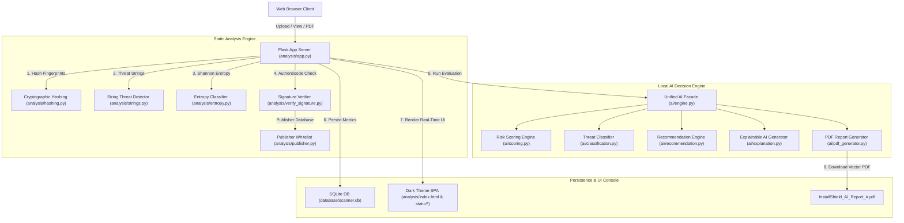

# 🛡️ InstallShield AI (v2.4) — Automated Fake Software Installer Detector

[](https://www.python.org/)
[](LICENSE)
[]()
[]()
[]()

**InstallShield AI** is an enterprise-grade, 100% offline static malware analysis and security assessment platform. It is engineered to detect disguised software installers, trojans, ransomware droppers, adware, and bundled Potentially Unwanted Programs (PUPs) before execution.

The system combines **Cryptographic Fingerprinting**, **Shannon Entropy Obfuscation Measurement**, **Native API & String Threat Extraction**, **Authenticode Digital Signature Verification**, a **Deterministic Local AI Risk Scoring Engine**, and a **ReportLab Vector PDF Assessment Export**.

---

## 🌟 Key Features

* **⚡ Universal Non-Blocking Analysis Pipeline**: Accepts any binary payload (`.exe`, `.msi`, `.dll`, `.sys`, `.cab`, `.zip`), extracting metadata without hard-blocking uploads. Header anomalies are flagged as risk factors in the analysis report.
* **🔑 Cryptographic Fingerprinting**: Computes MD5, SHA-1, and SHA-256 binary signatures using 64KB chunk streaming ($O(1)$ RAM usage).
* **📊 Shannon Entropy Measurement**: Calculates binary byte distribution entropy ($0.0 - 8.0$) to detect obfuscation, packing (e.g., UPX, Themida), or encrypted payloads ($H > 7.5$).
* **🧩 Native API & String Threat Extractor**: Parses printable ASCII and UTF-16LE strings to detect high-risk memory injection APIs (`VirtualAllocEx`, `WriteProcessMemory`, `CreateRemoteThread`), command utilities (`cmd.exe`, `powershell`), and C2 network URLs.
* **🛡️ Authenticode & Publisher Verification**: Inspects digital signatures and validates signers against a trusted vendor whitelist with word-boundary anti-spoofing regex matching.
* **🧠 100% Offline Local AI Decision Engine**:
  * **Risk Scoring Engine ($0–100$)**: Weighted threat index score categorized into `Clean`, `Low Risk`, `Suspicious`, `High Risk`, and `Malicious`.
  * **Threat Classifier**: Standardized payload classification (`Ransomware`, `Backdoor`, `Dropper`, `Packed Binary`, `PUP`, `Trusted Software`).
  * **Explainable AI (XAI) & Actionable Guidance**: Synthesizes human-readable risk breakdowns and prioritized remediation steps (`CRITICAL`, `HIGH`, `MEDIUM`, `LOW`).
* **📄 ReportLab Vector PDF Export**: Generates printable PDF security assessment reports (`InstallShield_AI_Report_#.pdf`) featuring executive summaries, hash tables, and recommendation cards.
* **🎨 Modern Wow-Factor Dark Theme Console**: Responsive dark-themed SPA UI featuring Chart.js visual analytics, drag-and-drop file uploader, real-time string search, and SQLite database controls.

---

## 🏗️ System Architecture & Data Flow



---

## 📂 Project Directory Structure

```text
installsheildai-main/
├── ai/                         # Local AI Decision & Intelligence Pipeline
│   ├── __init__.py
│   ├── engine.py              # Unified AI Facade
│   ├── scoring.py             # Risk Scoring Engine (0-100 Index)
│   ├── classification.py      # Threat Classifier & Categorization
│   ├── recommendation.py      # Actionable Guidance Generator
│   ├── explanation.py         # Explainable AI (XAI) Narrative
│   └── pdf_generator.py       # ReportLab PDF Document Generator
├── analysis/                   # Core Backend, Analysis & Web Console
│   ├── app.py                 # Flask App Server & REST Endpoints
│   ├── hashing.py             # MD5, SHA-1, SHA-256 & Metadata Extractor
│   ├── strings.py             # ASCII/UTF-16 String & Threat Extractor
│   ├── entropy.py             # Shannon Entropy & Obfuscation Analyzer
│   ├── verify_signature.py    # Authenticode Signature Verifier
│   ├── publisher.py           # Trusted Publisher Whitelist Engine
│   ├── db.py                  # SQLite Schema & Auto-Migrations
│   ├── operations.py          # SQLite Query Operations Layer
│   ├── trusted_publishers.json# Whitelisted Vendors List
│   ├── index.html             # Single Page Application Layout
│   ├── static/
│   │   ├── app.js             # Client UI Logic & Real-Time Sync
│   │   └── style.css          # Dark Theme Glassmorphism Design System
│   └── test_*.py              # Automated Unit Test Suite
├── database/                   # Database Storage Directory
│   ├── scanner.db             # Local SQLite Database
│   └── operations.py          # Database Operations Compatibility Shim
├── signature/                  # Signature Module Compatibility Layer
│   ├── publisher.py
│   └── verify_signature.py
├── requirements.txt            # Python Dependencies
├── README.md                   # Full Project Documentation
├── member-1.md                 # Member 1 Work & Changes Log
├── member-2.md                 # Member 2 Work & Changes Log
├── member-3.md                 # Member 3 Work & Changes Log
├── member-4.md                 # Member 4 Work & Changes Log
└── member-5.md                 # Member 5 Work & Changes Log
```

---

## 🛠️ Installation & Setup Guide

### 1. Prerequisites
* **Python 3.10** or higher
* **pip** (Python package installer)
* Operating System: Linux, Windows, or macOS

### 2. Clone Repository & Setup Virtual Environment
```bash
git clone https://github.com/fake-software-installer-detector/installsheildai.git
cd installsheildai

# Create virtual environment
python3 -m venv .venv

# Activate virtual environment
# On Linux/macOS:
source .venv/bin/activate
# On Windows:
# .venv\Scripts\activate
```

### 3. Install Dependencies
```bash
pip install -r requirements.txt
```

### 4. Launch Application Server
```bash
PYTHONPATH=. python analysis/app.py
```
Open your web browser and navigate to: **[http://127.0.0.1:5000](http://127.0.0.1:5000)**

---

## 📡 REST API Documentation

| Method | Endpoint | Description |
| :--- | :--- | :--- |
| `GET` | `/` | Renders the InstallShield AI Single Page Application UI. |
| `POST` | `/upload` | Accepts multipart installer payload (`installer`), analyzes file, persists to SQLite DB, and returns JSON assessment. |
| `GET` | `/api/scans` | Returns JSON array of all scan records stored in SQLite database. |
| `GET` | `/api/scans/<id>` | Returns JSON details for a specific scan ID. |
| `DELETE` | `/api/scans` | Clears all scan history records from the SQLite database. |
| `DELETE` | `/api/scans/<id>` | Deletes a single scan record by ID. |
| `GET` | `/api/scans/<id>/report` | Generates and streams ReportLab vector PDF assessment report (`.pdf`). |
| `GET` | `/api/scans/latest/report` | Generates and streams PDF report for the most recent scan. |

---

## 🧪 Running Automated Unit Tests

Run the complete 29-test unit test suite covering signature verification, static analysis, risk scoring, threat classification, XAI narrative, and PDF generation:

```bash
python -m unittest analysis/test_signature_verification.py analysis/test_static_analysis.py analysis/test_ai_engine.py
```

**Expected Test Output**:
```text
.............................
----------------------------------------------------------------------
Ran 29 tests in 0.035s

OK
```

---

## 🤝 Contribution Guidelines

We welcome contributions! Please follow these guidelines when submitting pull requests:

1. **Fork & Branching**:
   * Create feature branches from `main` or `beta-dev`:
     ```bash
     git checkout -b feature/your-feature-name
     ```
2. **Coding & Documentation Standards**:
   * Follow PEP 8 guidelines for Python backend modules.
   * Preserve modular decoupling between static analysis (`analysis/*`) and local AI decision engines (`ai/*`).
   * Maintain unit test coverage for new methods.
3. **Submitting Pull Requests**:
   * Ensure all 29 unit tests pass cleanly (`python -m unittest analysis/test_*.py`).
   * Submit a Pull Request targeting `beta-dev` or `main` with a clear description of changes.

---

## 📜 License & Compliance

Distributed under the MIT License. 100% self-contained and offline — zero data leaves your local machine.
